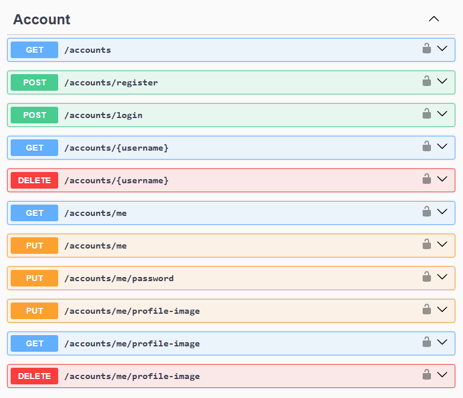
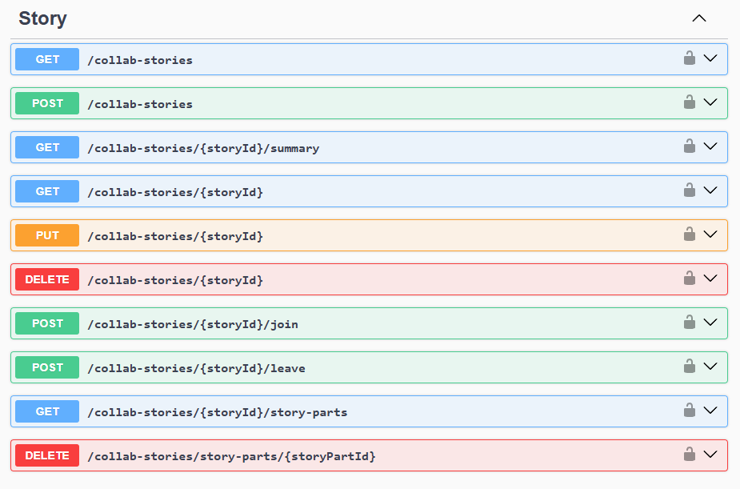
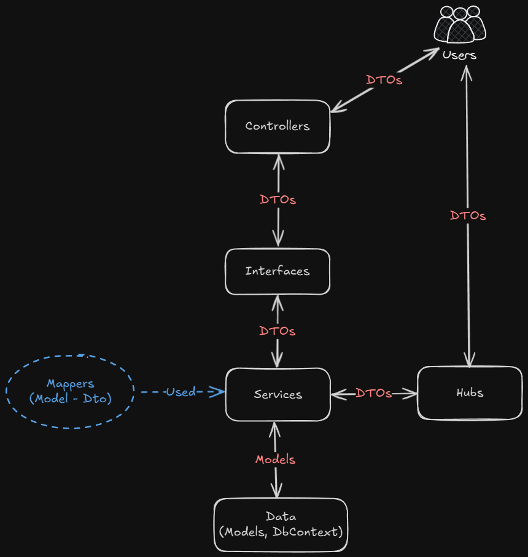
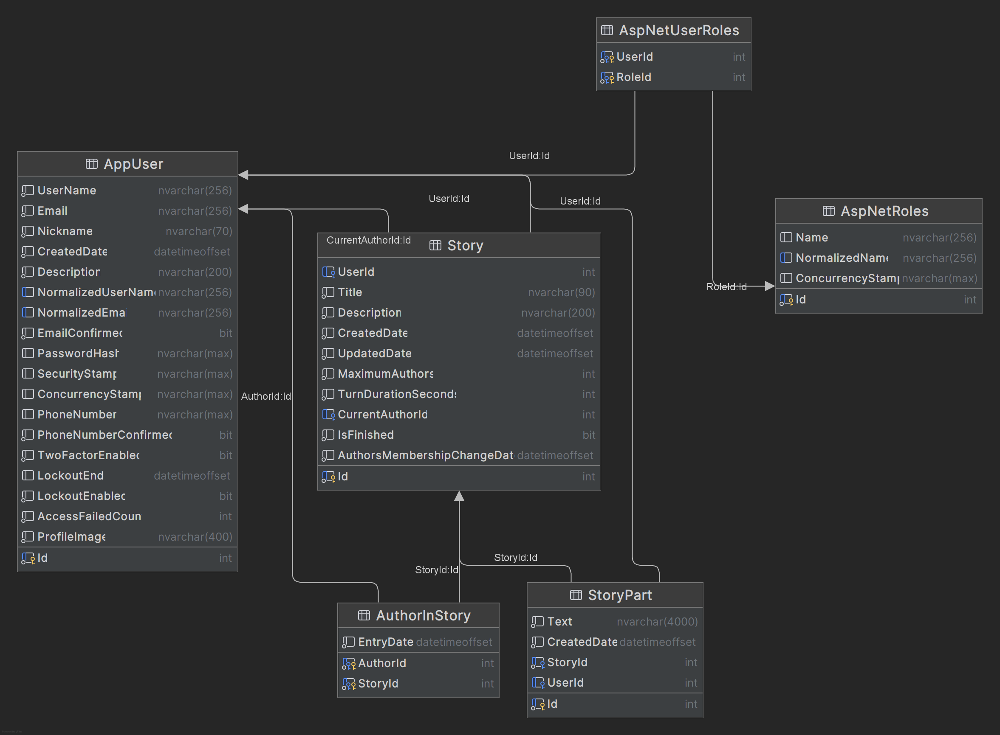

# 📔 CollabStories
A web platform for real-time collaborative storytelling, built with ASP.NET Core Web API for the backend and React for the frontend.

---

## ✨ Features
- **Story Creation and Collaboration**
    - Authors can create new stories and write together in real-time.
- **Story Participants**
    - Each story session has a **user owner** who manages the session and **authors** who contribute to the story. The owner is always the first author.
- **Turn-Based Writing**
    - Each author has a limited time per turn, and the next user continues writing after the turn ends.
    - Each session has it own timer validated on the backend.
- **Session Rules Management**
    - Owners can define session parameters: duration, maximum authors, etc.
- **Authentication**
    - Users can register and log in securely using **JWT authentication**.
- **Testing**
    - The backend includes **unit tests** to validate individual components and **integration tests** to ensure end-to-end functionality.

---

## 📸 Media
### Backend
<details>
    <summary><b>Account Endpoints</b></summary>
    
</details>
<details>
    <summary><b>Story Endpoints</b></summary>
    
</details>
<details>
    <summary><b>Data Flow Diagram</b></summary>
    
</details>
<details>
    <summary><b>Database Diagram</b></summary>
    
</details>

### Chat Demo (temporary)
*Will be removed after frontend completion, this is just a prototype.*

https://github.com/user-attachments/assets/fa2e6b93-ff57-4c7e-a7df-92b3dd01da19


### Frontend
Building ...

---

## 🚀 Future Features
### Homepage
- Latest stories
- Infinite scrolling navigation

---

## 🛠 Setup
### Prerequisites
- [.NET 8 SDK](https://dotnet.microsoft.com/en-us/download/dotnet/8.0) (Not needed if API will be running only inside docker container).
- [Docker](https://www.docker.com/get-started/)
- [Node.js](https://nodejs.org/en/download)

### Steps (Backend)
1. Clone the repository.
2. Inside `backend/`, copy `.env.example` to `.env`.
   - In `.env`, update the passwords for `MSSQL_PASSWORD`, `MSSQL_CONNECTION_STRING` and `JWT_SECRET`, if you want to change the default values.
3. Open a terminal and navigate to the `backend/` directory.
4. Run the following command to initialize database inside container.
   ```bash
   docker compose up db --build
   ```
5. Configure User Secrets (optional)
   - **You may skip this step if API will be running only inside container and not locally.**
   - Navigate to `backend/api` inside the terminal.
   - Set the required secrets using the following commands (you can change the password in the first three commands, just like in the .env file, seen in step 2):
     ```bash
     dotnet user-secrets set "ConnectionStrings:DefaultConnection" "Server=localhost,1434; Database=CollabStoriesDB; MultipleActiveResultSets=True;User ID=sa;Password='examplePassword1234'; Encrypt=False;"
     dotnet user-secrets set "ConnectionStrings:DbTestConnection" "Server=localhost,1434; Database=CollabStoriesDBTest; MultipleActiveResultSets=True;User ID=sa;Password='examplePassword1234'; Encrypt=False;"
     dotnet user-secrets set "JwtConfig:Secret" "a-string-secret-at-least-256-bits-long"
     dotnet user-secrets set "JwtConfig:ValidIssuer" "http://localhost:5014/"
     dotnet user-secrets set "JwtConfig:ValidAudiences" "http://localhost:5014/"
     ```
6. Run the API:
   1. **Using Docker**
      - Navigate to the `backend/` directory.
      - Run the docker command:
        ```
        docker compose up --build
        ```
      - ⚠️ Note: On the first run, the application will seed the database. Wait until you see the confirmation in the console before making API requests.        
   2. **Locally**
      - In the `backend/api/` directory.
      - Run the application:
        ```bash
        dotnet run
        ```
      - ⚠️ Note: On the first run, the application will seed the database. Wait until you see the confirmation in the console before making API requests.
7. Access the API documentation:
   - Open your browser and navigate to http://localhost:5014/swagger to view the Swagger API documentation.

---

## ⚙ Technologies
### Backend
- **Language**: C#  
- **Framework**: ASP.NET Core Web API 8  
- **Database**: SQL Server 2022  
- **ORM**: Entity Framework Core 8  
- **Authentication**: JWT with ASP.NET Identity  
- **Real-time Communication**: SignalR  
- **Containerization**: Docker  
- **Testing**: xUnit  
- **Fake Data**: Bogus  
- **API Documentation**: Swagger  

### Frontend
- **Languages**: JavaScript, HTML, CSS  
- **Frameworks**: React, Vue  
- **Real-time Communication**: SignalR Client  

---

## 🙋‍♂️ Authors
- **Rafael Silva** - API & Database ([LinkedIn](https://www.linkedin.com/in/rafa-silva-v/))
- **Pedro Sousa** - Frontend ([LinkedIn](https://www.linkedin.com/in/dsousr/))
