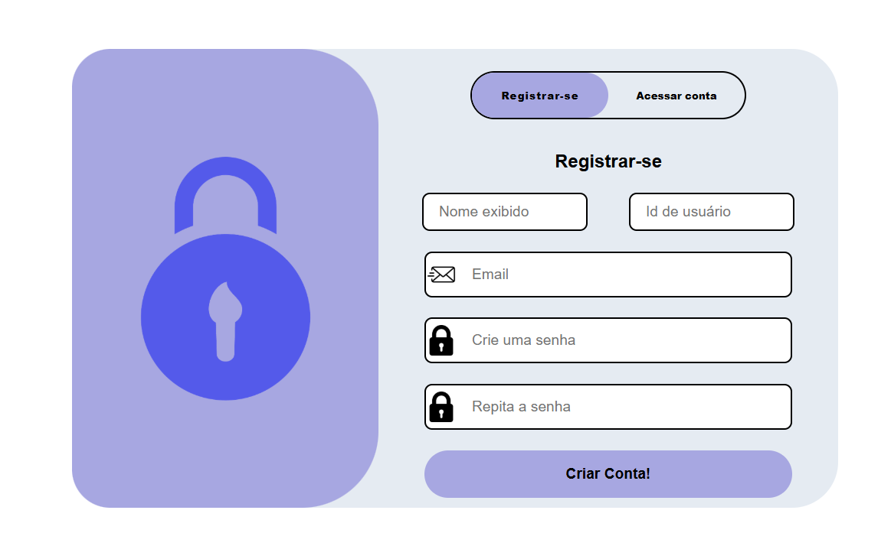
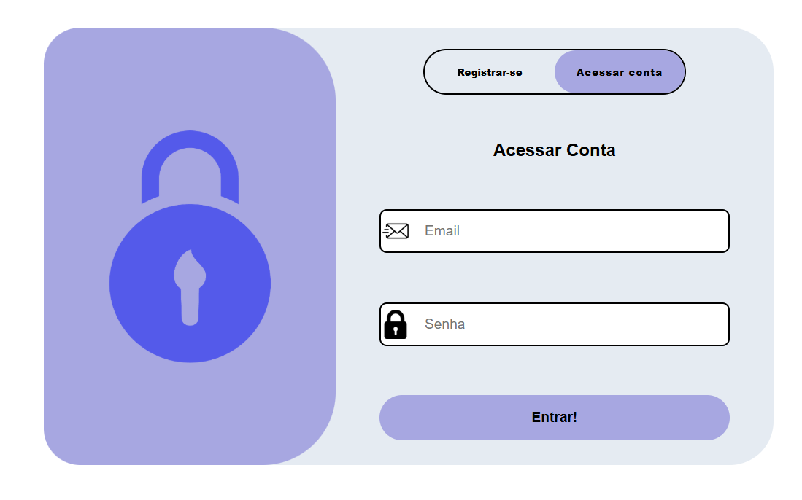
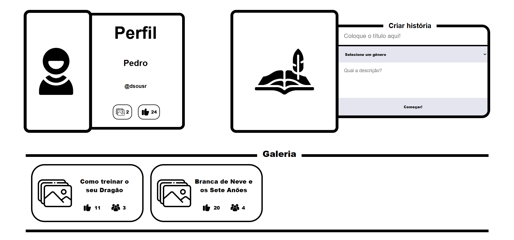
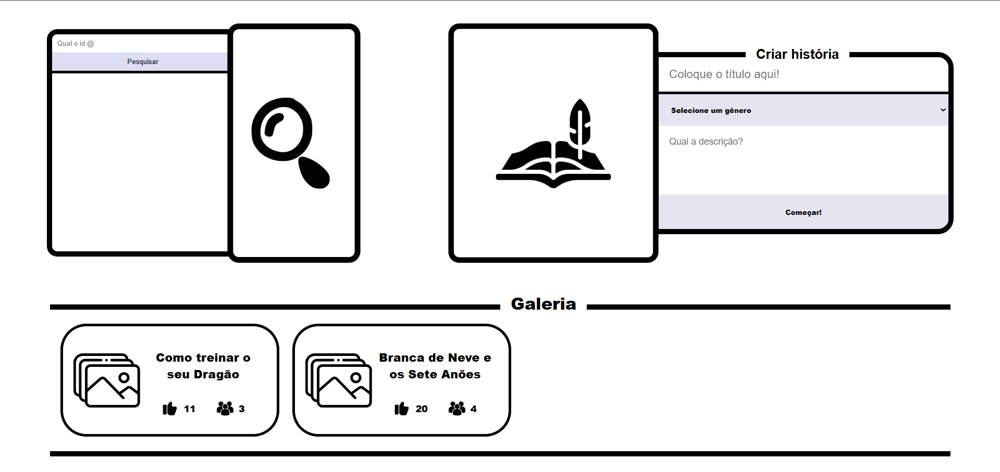
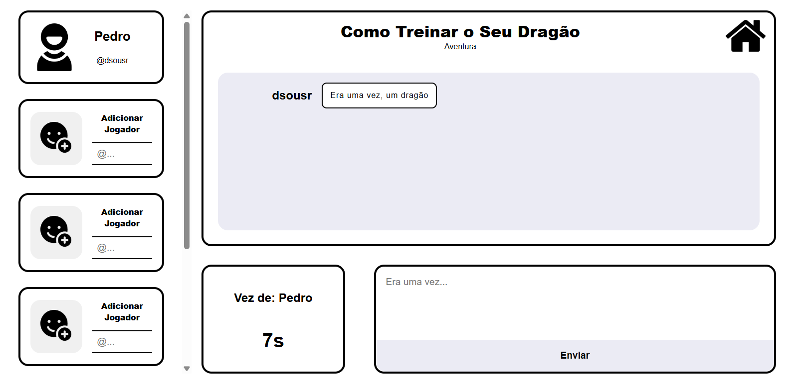

# Front-End

## Installation:

1: npm i

2: npm i react-router-dom

## Technologies:

    React, JavaScript, CSS e React-Router-Dom (Navigation)

## Features:

### 🔑 Login and Register:

- Create an account with email, password, and password confirmation.

- Display name is not unique.

- Each player has a unique ID used to invite others to a room.

- After registering, the user is redirected to the Home page.

### 🏠 Home:

- Shows player profile (likes received and number of stories created).

- Button next to the profile opens the search by player ID section.

- Create Story: enter a title, description, and genre (horror, comedy, etc.).

- Gallery with all stories created.

### 📖 Story:

- The creator can invite up to 5 players.

- Each player has 30 seconds to contribute to the story.

- Header: shows title, genre, and button to go back to Home.

- Body: displays all contributions made so far.

- Timer: shows the current player and remaining time.

- Text box + Send button to add the contribution.

